# ResCutes

**Philippine animal rescue coordination - from citizen report to shelter intake, medical clearance, and adoption.**

[](https://nextjs.org/)
[](https://www.typescriptlang.org/)
[](https://react.dev/)
[](https://tailwindcss.com/)
[](https://rescutes.vercel.app/)
[](https://rescutes.vercel.app/)

**AnimalHack 2026** submission - track: supporting animal shelters, rescues, and foster programs.

---

## 60-second pitch

In the Philippines, animal rescue reports still scatter across Facebook posts, group chats, phone calls, and informal rescuer networks. That fragmentation produces duplicate reports, delayed response, animals sent to shelters with no capacity or the wrong medical capabilities, and cases that become impossible to track after the animal is picked up.

**ResCutes** is one coordinated workflow for that path: citizens and rescuers use a mobile PWA; shelter staff and veterinarians run operations on a web dashboard. Both surfaces share one Next.js codebase, Neon PostgreSQL, and Neon Auth.

Urgency is scored from visible injury, environmental danger, vulnerability, and time waiting after verification - with human-readable factor explanations, not a black-box priority flag. Shelter destinations are ranked by capability match, free capacity, species fit, distance, and workload - each recommendation ships with explicit reasons and warnings.

---

## Try it now

**Live demo:** [https://rescutes.vercel.app/](https://rescutes.vercel.app/)

Sign in at [/login](https://rescutes.vercel.app/login). All seeded demo accounts use password **`demo1234`**.

| Role          | Email                   | Password   |
| ------------- | ----------------------- | ---------- |
| Citizen       | `citizen@rescutes.demo` | `demo1234` |
| Rescuer       | `rescuer@rescutes.demo` | `demo1234` |
| Shelter staff | `staff@rescutes.demo`   | `demo1234` |
| Veterinarian  | `vet@rescutes.demo`     | `demo1234` |
| Administrator | `admin@rescutes.demo`   | `demo1234` |

Citizens and rescuers land on `/mobile`. Staff and veterinarians land on `/dashboard` (mobile is gated). Administrators can use both.

---

## What makes this different

### 1. Explainable rescue urgency (`src/lib/urgency/scoring.ts`)

Score is 0-100 from four additive factors (capped at 100):

| Factor                          | Max points | Example values from code                         |
| ------------------------------- | ---------- | ------------------------------------------------ |
| Visible injury severity         | 35         | `none_visible` 0 · `moderate` 20 · `critical` 35 |
| Environmental danger            | 30         | `traffic` 25 · `trapped` 30                      |
| Animal vulnerability            | 20         | `juvenile` 12 · `nursing` 18 · `disabled` 20     |
| Time waiting after verification | 15         | &lt;1h → 2 · 12h+ → 15                           |

Levels: **critical** ≥80, **high** ≥60, **medium** ≥30, else **low**. Each factor returns a plain-language explanation (e.g. "Animal near traffic or busy road"), and the result surfaces the top factors in a readable summary string. Staff can override with a reason when field judgment differs from the formula.

**Example:** severe injury (28) + traffic (25) + nursing (18) = **71 → High**, before wait-time points accumulate.

### 2. Capacity / capability shelter routing (`src/lib/routing/shelter-routing.ts`)

Staff destination recommendations weight:

- Capability match **35%**
- Available capacity **25%**
- Species acceptance **20%**
- Distance (haversine km) **15%**
- Operational workload **5%**

Each ranked shelter includes `reasons` (e.g. "Has all required medical capabilities", "12 spaces available", "Within 4.2 km") and `warnings` (e.g. "No available capacity", "Missing: emergency surgery"). Mobile also has a nearest-shelter quiz (`src/lib/maps/nearest-shelter-match.ts`) that prefers species fit, then care/emergency capabilities, then distance across the Philippines shelter directory.

---

## End-to-end workflow

Primary write path (from `src/lib/rescue-stages.ts`):

`report_submitted` → `verified` → `rescuer_assigned` → `animal_secured` → `shelter_handoff` → `completed`

Closed outcomes: `rejected` · `duplicate` · `cancelled`. After intake, animals move through medical clearance stages (`awaiting_examination` → … → `medically_cleared`) and into adoption/foster.

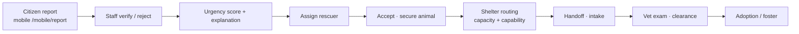

---

## Two interfaces, one codebase

### Mobile PWA (citizens & rescuers)

| Route                                 | Purpose                                |
| ------------------------------------- | -------------------------------------- |
| `/mobile`                             | Map home - shelters + open field cases |
| `/mobile/report`                      | Camera / location report flow          |
| `/mobile/cases`, `/mobile/cases/[id]` | Track own reports and case detail      |
| `/mobile/assignments/[id]`            | Accept / decline dispatch              |
| `/mobile/adoption`                    | Swipe / browse adoption queue          |
| `/mobile/profile`                     | Profile + required phone contact       |

### Web dashboard (staff, vets, admin)

| Route                                                      | Purpose                               |
| ---------------------------------------------------------- | ------------------------------------- |
| `/dashboard`                                               | Operations overview + live map        |
| `/rescue-cases`, `/rescue-cases/new`, `/rescue-cases/[id]` | Verify, dispatch, status, notes       |
| `/animals`, `/animals/new`, `/animals/[id]`                | Shelter animal registry               |
| `/medical`                                                 | Clearance queue and clinical workflow |
| `/adoption`                                                | Ready animals + application review    |
| `/shelters`                                                | Philippines shelter map / directory   |
| `/users`                                                   | Admin user directory                  |
| `/settings`, `/profile`                                    | Shelter settings and account          |

Public: `/` landing, `/login` (also `/sign-in`).

---

## Screenshots

Fresh captures from the live demo ([rescutes.vercel.app](https://rescutes.vercel.app/)) via Playwright - landing workflow, web ops, and mobile PWA.

### Landing - brand + 4-step pathway

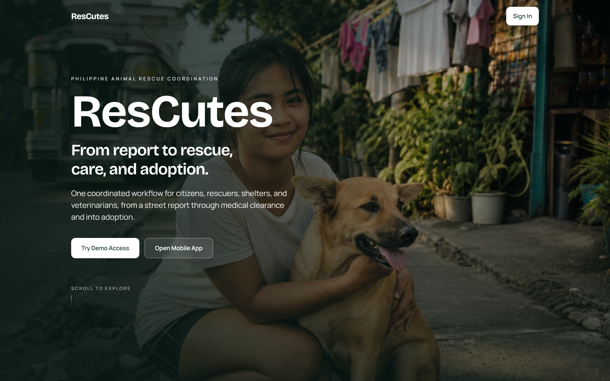

_Hero: Philippine animal rescue coordination, Try Demo Access, Open Mobile App._

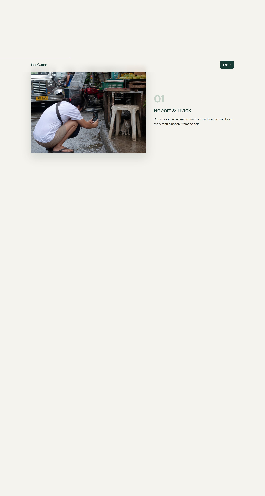

_01 Report & Track - citizens pin location and follow status updates._

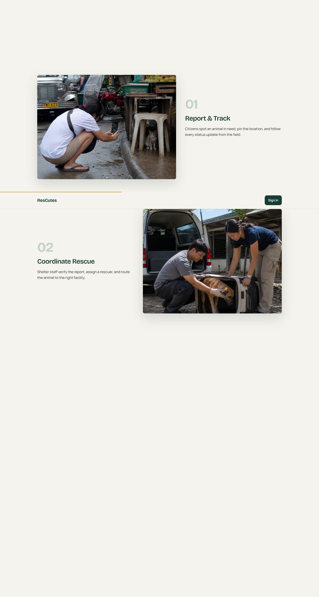

_02 Coordinate Rescue - staff verify, assign a rescuer, route to the right facility._

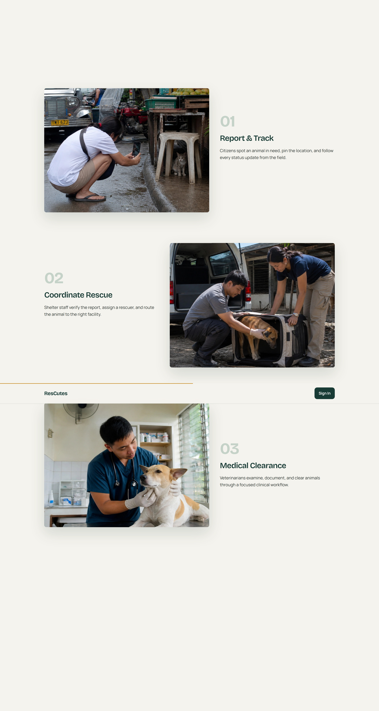

_03 Medical Clearance - veterinarians examine, document, and clear animals._

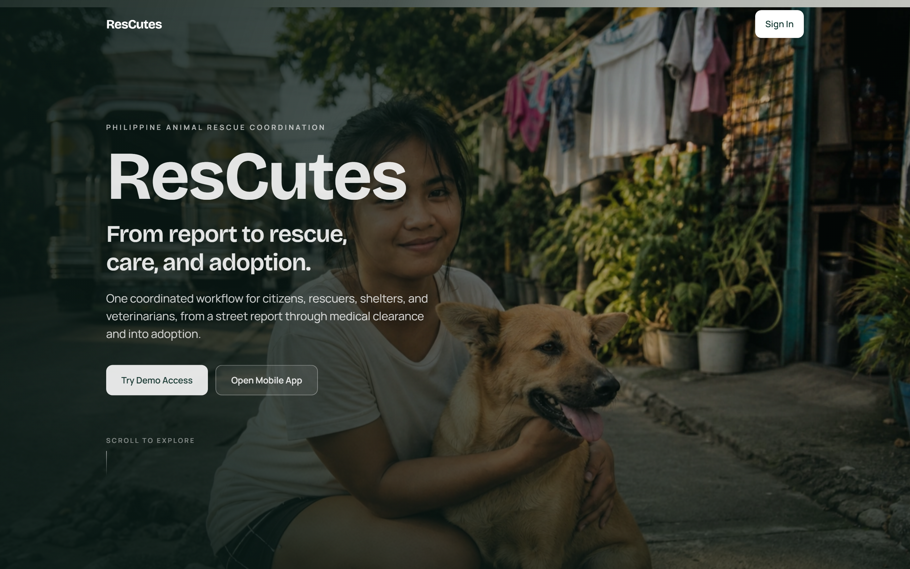

_04 Adoption - cleared animals move to adoption on web and mobile._

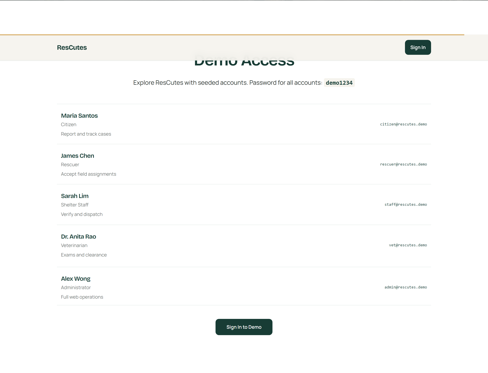

_Demo Access: one-click roles for citizen, rescuer, staff, vet, and admin._

### Web dashboard - operations

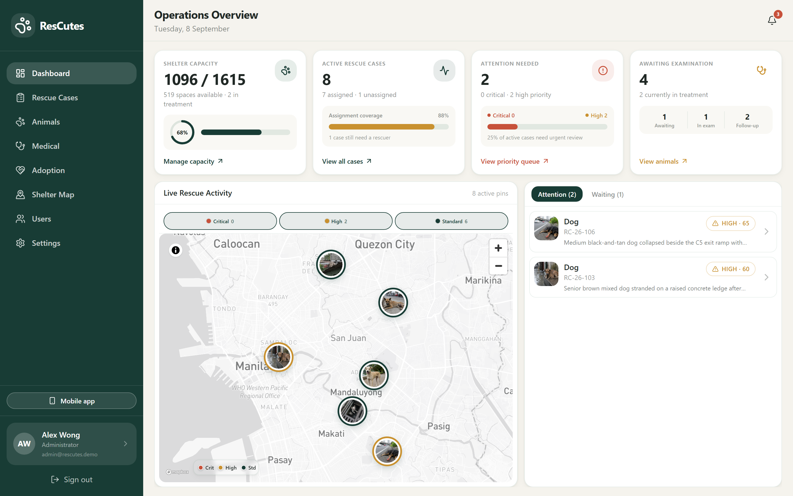

_Dashboard: shelter capacity, active cases, attention queue with scored urgency, live Metro Manila map._

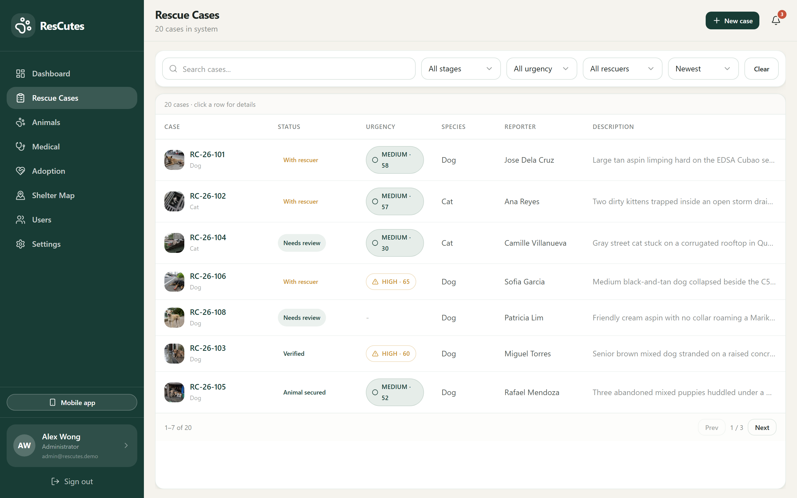

_Rescue Cases: searchable, filterable case list with status stages and urgency scores._

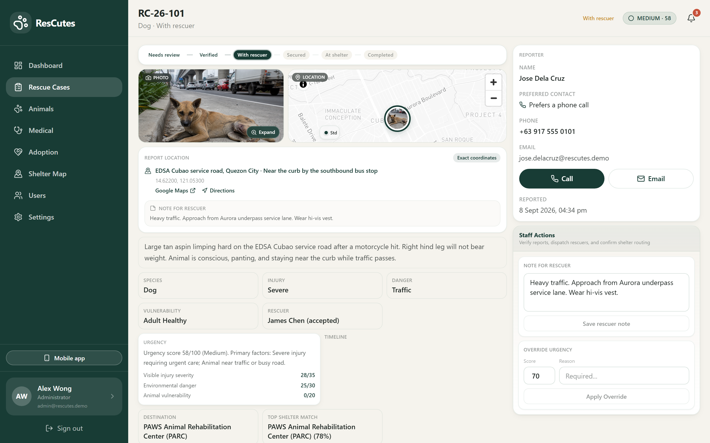

_Case detail: status pipeline, injury/danger factors, explainable urgency (e.g. 58/100), top shelter match with reasons, reporter Call/Email, staff actions._

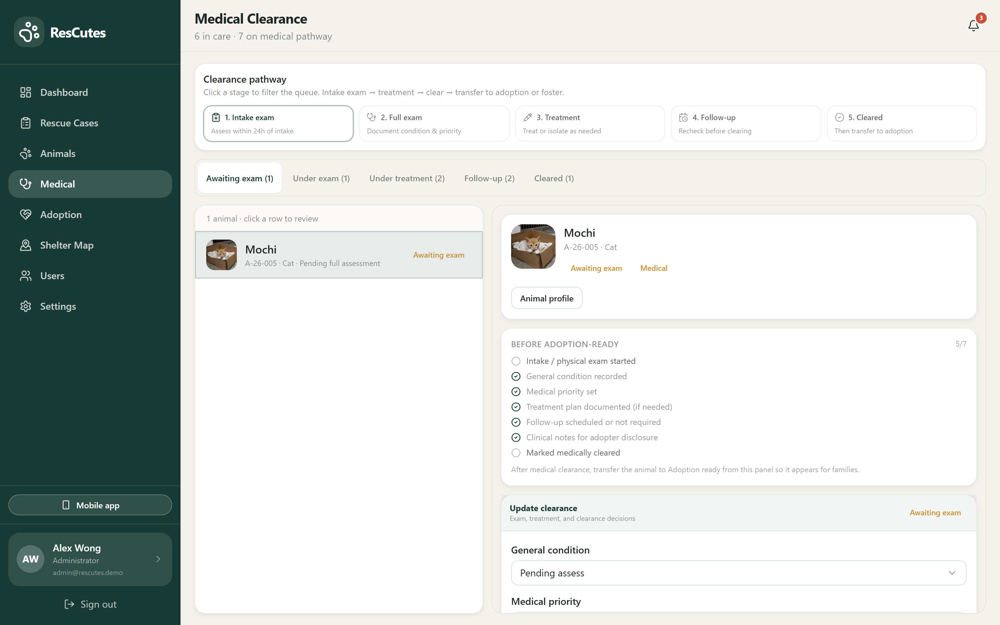

_Medical: clearance pathway (intake → exam → treatment → follow-up → cleared) with clinical checklist._

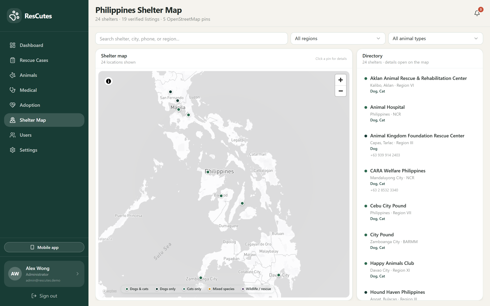

_Shelter Map: 24 listings, capacity/species filters, routing partners across the Philippines._

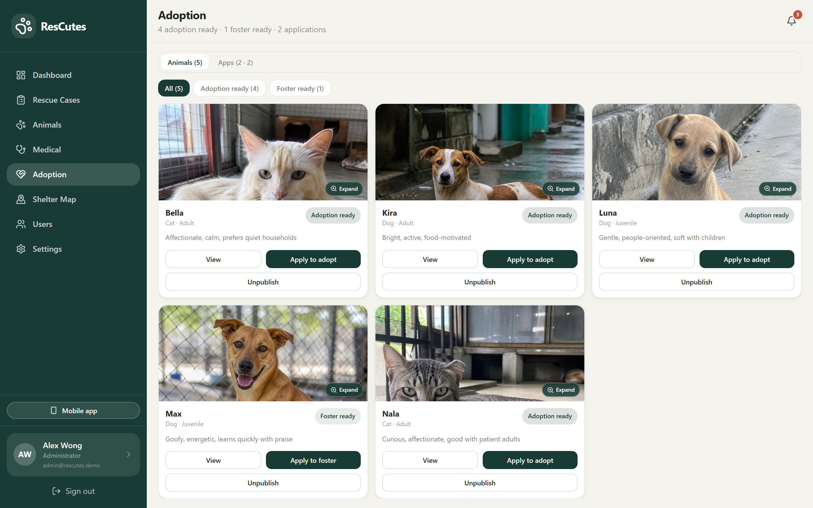

_Adoption: medically cleared animals ready for adoption or foster, plus applications review._

### Mobile PWA - field + citizen

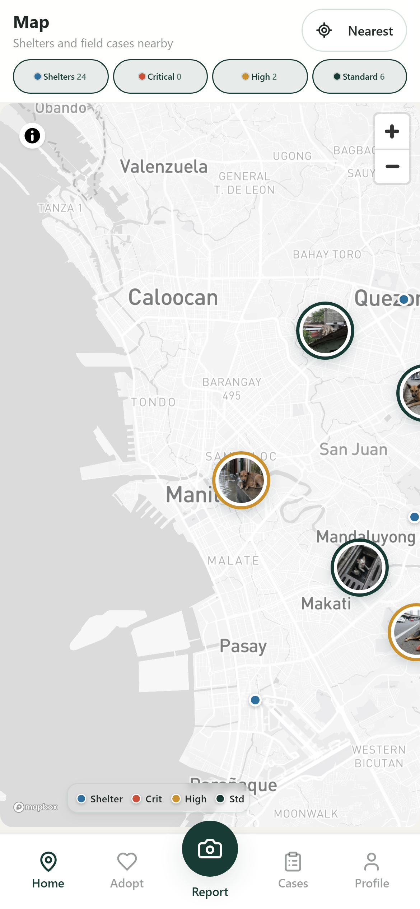

_Mobile home map: Shelters / Critical / High / Standard layers, photo pins, Report camera CTA._

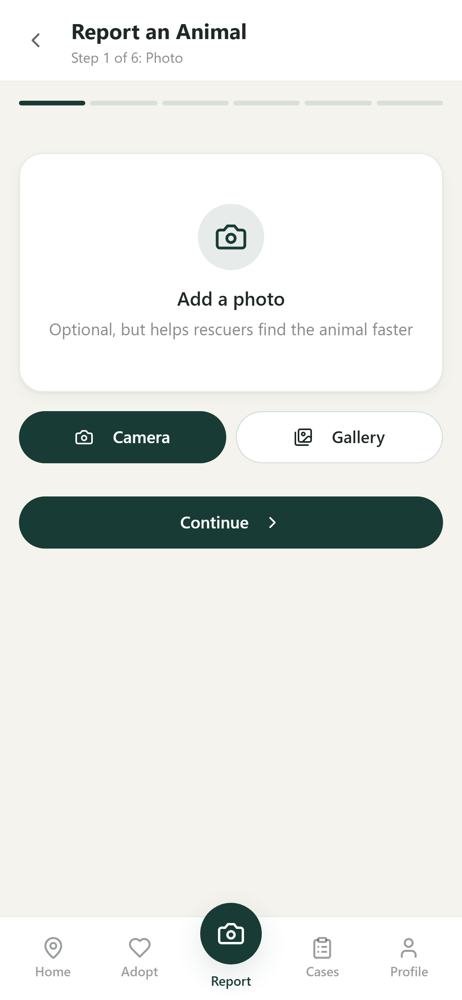

_Report an animal: multi-step flow starting with camera/gallery photo capture._

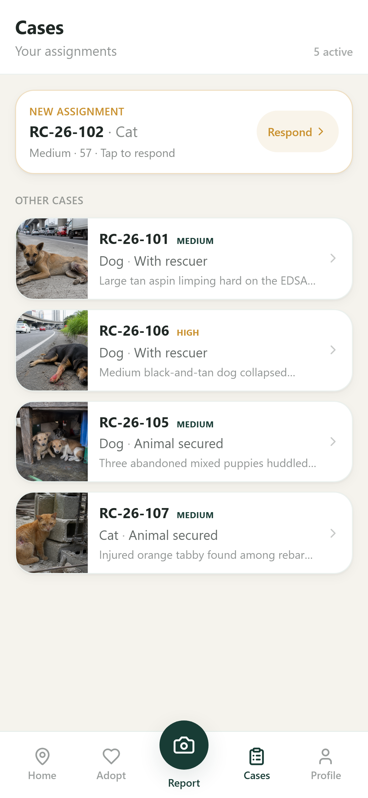

_Cases: track own reports and rescuer assignments on the phone._

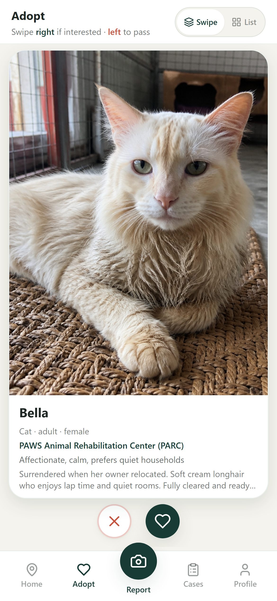

_Mobile adoption: discover cleared animals on the go._

Regenerate anytime:

```powershell
node scripts/capture-readme-screenshots.mjs
```

---

## Built like a real product, not a slide deck

| Evidence                                           | Source                                                                                                      |
| -------------------------------------------------- | ----------------------------------------------------------------------------------------------------------- |
| **QA re-audit 90 / 100** (8 Sep 2026, Asia/Manila) | `ResCutes-QA-Reaudit-Report.md` - post-remediation vs baseline **64 / 100**                                 |
| **+26** score lift on former blockers              | Create routes, name validation, verify/dispatch, staff/vet mobile gate, narrow layouts, reporter Call/Email |
| **35** automated test files                        | 20 under `src/**/*.test.ts` (Vitest) + 15 under `e2e/*.spec.ts` (Playwright)                                |
| Role-gated surfaces                                | Staff/vet `/mobile` → `/dashboard`; citizen/rescuer cannot use web ops                                      |
| Shared persistence                                 | Neon PostgreSQL via Drizzle (`src/db/schema.ts`, `src/lib/data/db/repository.ts`)                           |

Roles in schema: `citizen`, `rescuer`, `shelter_staff`, `veterinarian`, `administrator`.

---

## Tech stack

| Area       | From `package.json`                      |
| ---------- | ---------------------------------------- |
| Framework  | Next.js 15 (App Router)                  |
| Language   | TypeScript                               |
| UI         | React 19, Tailwind CSS, Radix UI, Motion |
| Auth       | `@neondatabase/auth`                     |
| Database   | `@neondatabase/serverless`, Drizzle ORM  |
| Maps       | Mapbox GL                                |
| Uploads    | `@vercel/blob` (optional)                |
| Validation | Zod                                      |
| Tests      | Vitest, Playwright                       |
| Charts     | Recharts                                 |

Deploy target: Vercel (`vercel.json` region `sin1`). Runtime: Node **24.x** (`engines`).

---

## Run it locally

```powershell
git clone https://github.com/Rapnunu/ResCutes.git
cd ResCutes
git checkout main
npm install --legacy-peer-deps
Copy-Item .env.example .env.local
# fill .env.local, then:
npm run db:push
npm run db:seed
npm run db:seed-animals
npm run dev
```

Open [http://localhost:3000](http://localhost:3000).

### Environment variables

Copy `.env.example` → `.env.local`. Never commit secrets.

| Variable                   | Purpose                                                   |
| -------------------------- | --------------------------------------------------------- |
| `DATABASE_URL`             | Neon PostgreSQL connection string (required)              |
| `NEON_AUTH_BASE_URL`       | Neon Auth project URL (required for login)                |
| `NEON_AUTH_COOKIE_SECRET`  | Session cookie signing secret (required)                  |
| `NEXT_PUBLIC_MAPBOX_TOKEN` | Mapbox public token for maps                              |
| `BLOB_READ_WRITE_TOKEN`    | Vercel Blob for photo uploads (recommended in production) |

Optional: `NEXT_PUBLIC_SITE_URL`, `SEED_AUTH_ORIGIN` (see `.env.example`).

### Deploy on Vercel

1. Import [Rapnunu/ResCutes](https://github.com/Rapnunu/ResCutes) into Vercel (Next.js, root `.`).
2. Set the same env vars for Production (and Preview if needed).
3. Add the Vercel URL to Neon Auth trusted domains.
4. Ship from `main`. Confirm `/login`, `/dashboard`, and `/mobile`.

One project serves both surfaces. Stop `npm run dev` before `npm run build`.

Team workflow (branches, commits, PRs): [CONTRIBUTING.md](CONTRIBUTING.md).

---

## Team - AnimalHack 2026

BS Computer Science (Data Science specialization):

- Yuan Andrei Mariano
- Mark Adrian Bautista
- Raphael Edrian Tan
- Ivan Muñoz Untalan

Repository: [github.com/Rapnunu/ResCutes](https://github.com/Rapnunu/ResCutes)

---

## Hackathon fit / what's next

ResCutes maps directly to AnimalHack's **shelters, rescues, and foster programs** track: field reporting and rescuer dispatch, capacity-aware shelter handoff, veterinary clearance, and an adoption/foster surface for cleared animals - with a live demo judges can operate today.

If we had another week (grounded in the 8 Sep 2026 re-audit remaining polish and ops hardening):

1. Push medical and map UX further on the smallest phone frames (re-audit still flagged residual clip risk on `/medical` tabs and legend labels at ~390px).
2. Run CI Playwright smoke against a **dedicated** Neon test branch so demo data never shares a wipe path with local integration tests.
3. Re-run the full QA pass (including XSS create re-check) to move past the post-remediation **90 / 100** baseline with documented evidence.

---

_Evidence of outcome: open the [live demo](https://rescutes.vercel.app/), sign in with a demo account above, and walk report → verify → dispatch → medical → adoption on the seeded data._
